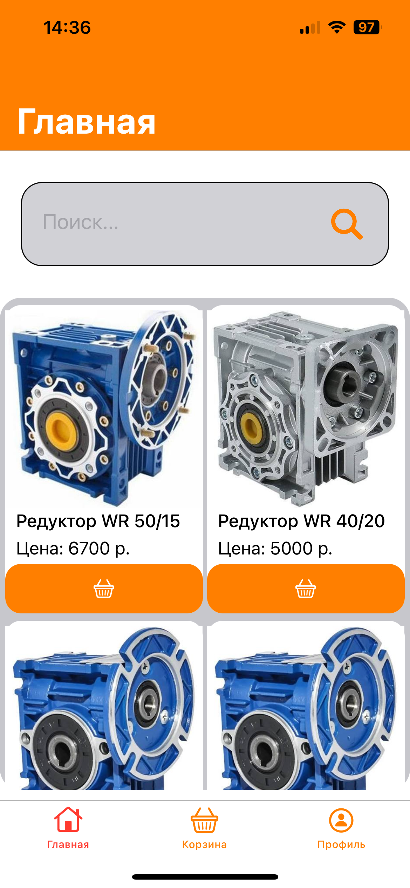
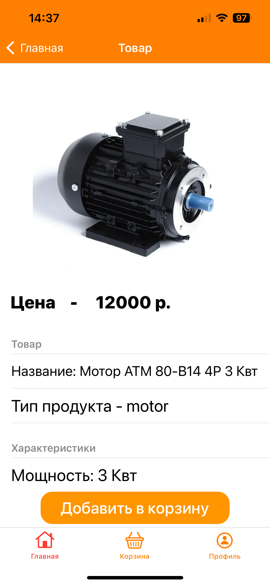
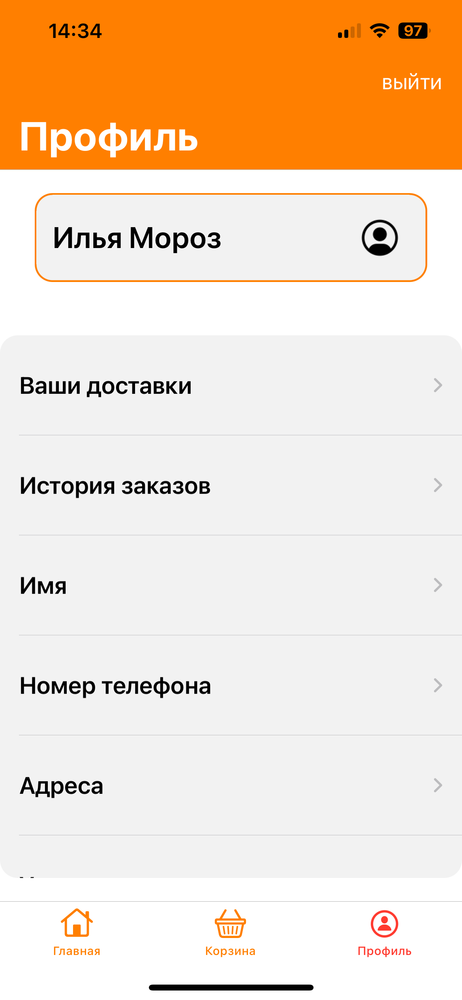
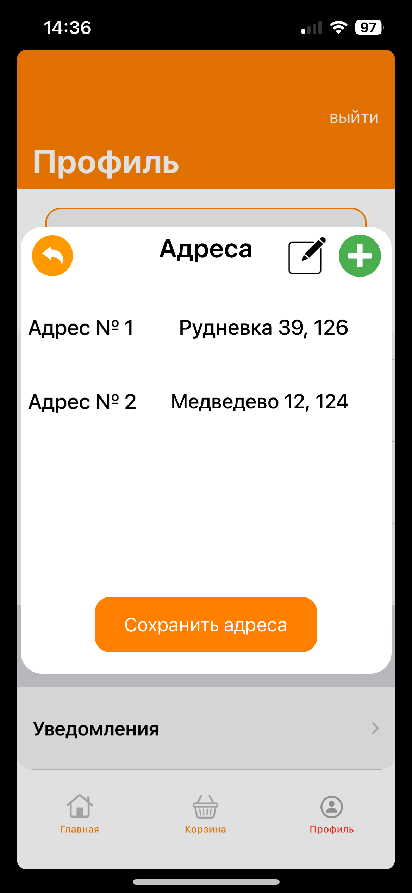
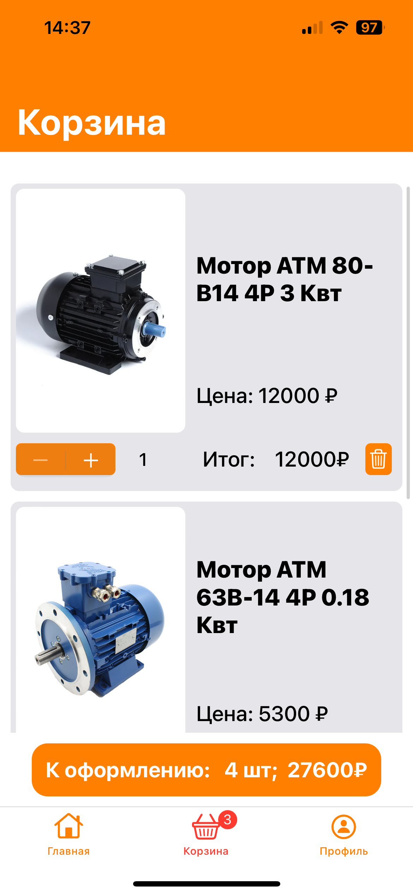

# EDS_Store

## Описание
EDS_Store - интернет магазин на платформе iOS, так как проект посвящен компании EDS-Privid, тематика приложения и уветовые решения были выбраны основываясь на дизайн компании и их деятельность
Приложение предлагает пользователю возможности просмтора каталога, добавления товаров в корзину. Также пользователь может менять данные о себе в разделе профиль.

## Технологии
- **Язык и основной фреймворк -** Swift, UIKit
- **Верстка экранов -** Кодом
- **Архитектура -** MVP
- **Навигация -** Между модулями - Cordinator, Внутри модулях - Router
- **Патерны проектирования -** Dependency Injection, Singleton, Factory
- **Сетевой слой -** URLSession
- **Базы данных -** Firebase
- **Конфигурация модулей -** Assembly Builder

## Иерархия
### Верхний уровень - UITabBarController
TabBar собирается и управляется с помощью Cordinator, Tabbar содержит массив NavigationController
Cordinator отвечает за создание модулец, и добавления NavContr в TabBar

### Нижний уровень (Модули)

Каждый Молуль представляет собой набор 1-го или более экранов, под экранами подразумевается сущность MVP (каждый "экран" имеет model, presenter и View) 
Работа с базой данной происходит через слой Firebase. Этот слой подключается к model. 

Внутри модуля за навигацию отвечает Router, он обращается к сборщику Assembly Builder который созадет новый экран, после чего Router переключает экран.

## Описание модулей
### Home

#### Описание - Модуль представляет собой два экрана.
- **Экран 1 - поедставляет собой каталог товаров.**
- **Экран 2 - отображает выбранный товар, информацию о нем, а также возможность добавления в корзину**
  
#### Экран 1 (Главный) 

#### Экран с продуктом 

#### Техническая часть 
- **Экран 1:** загружает данные из базы данных, расположеноой на Firebase Database, далее данные о продукции распаковываются в структуры, после чего отображаются в таблице, далее для каждой продукции, с помощью URLSession зашружается картинка по url.
- **Экран 2:** отображается при выборе товара, если пользователь захочет добавить товар в корзину, товар добавляется в массив корзины, который вызвается через Singleton

### Profile 

### Описание - Модуль представляет собой набор экранов: 
- **Экран регистрации**
- **Экран входа**
- **Оновной экран**

#### Экран регистрации 

#### Экран входа

#### Экран Профиль (главная)

#### Экран Выбор адресса

### Техническая часть
- **Экран входа:**  проверяет поля на корректность далее, запускает проверку на существования пользователя в базе данных на FireBase далее при успешном входе переносит на экран Профиль
- **Экран регистрации:** проверяет поля на корректность, далее идет проверка на то занет ли логин, если логи свободен то создается две записи в удальенных базах данных 
- **Экран основной:** предаставляет доступ к просмотру историй поупок, текущих доствавок, а также просматривать и измениять данные пользователя

  
### Basket

#### Описание - Модуль состоит из двух экранов:
- **Экран Корзина -**  позволяет просматривать и изменять корзину (позиции).
- **Экран Оформление заказа -** выббор адреса, а также выбор сопсобо полаты

#### Экран Корзина

#### Экран Оформление заказа

### Техническая часть
-- **     **
-- **     **
